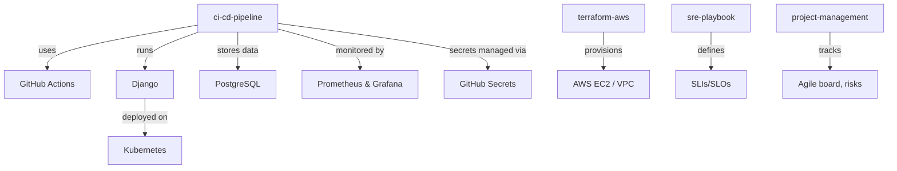

# Portfolio Architecture

## Overview

This repository demonstrates real‑world **DevOps**, **Cloud Engineering**, **Site Reliability**, and **Project Management** skills through a collection of modular, self‑contained projects.

## System Components



## Project Structure

| Directory | Purpose | Key Technologies |
|-----------|---------|------------------|
| `ci-cd-pipeline/` | Django application with full CI/CD; secrets injected via environment | Django, PostgreSQL, Docker Compose, GitHub Actions |
| `terraform-aws/` | Infrastructure as Code (AWS resources) | Terraform, AWS |
| `k8s-manifests/` | Kubernetes manifests for the Django app | Kubernetes, Docker |
| `monitoring/` | Observability stack | Prometheus, Grafana, Docker |
| `sre-playbook/` | SRE documents (SLO definitions, runbooks, incident response) | Markdown |
| `project-management/` | Project management artifacts | Markdown |

## CI/CD Flow (ci-cd-pipeline)

1. **Commit to `main`** triggers the CI/CD pipeline (`.github/workflows/ci-cd.yml`).
2. **Build**: Docker images for Django and PostgreSQL are built.
3. **Database preparation**: PostgreSQL container starts and becomes healthy.
4. **Migrations**: A temporary web container runs Django migrations.
5. **Service startup**: The web container starts with `gunicorn`.
6. **Test**: `curl` verifies the home page returns “Hello DevOps Portfolio!”.
7. **Secrets**: Database credentials are injected from GitHub Actions Secrets; they are never stored in code.

## Security & Secrets Management

- **Local development**: A `.env.example` file documents required environment variables. Developers copy it to `.env` and fill real values.
- **CI/CD**: Secrets are stored in [GitHub Actions Secrets](https://docs.github.com/en/actions/security-guides/encrypted-secrets) and injected into pipeline steps. They are masked in logs.
- **Pre‑commit & CI scanning**: [Gitleaks](https://github.com/gitleaks/gitleaks) runs on every commit (via pre‑commit hook) and every push (via GitHub Actions workflow) to prevent accidental secret exposure.
- **Docker Compose**: Uses `${VAR:-default}` syntax so the stack runs out‑of‑the‑box with safe defaults, but accepts real secrets when `DB_USER`, `DB_PASSWORD`, `DB_NAME` are set.

## Running Locally

Each sub‑project has its own `README.md`. For the main Django application:
```bash
cd ci-cd-pipeline
docker compose up --build
```

The architecture encourages modularity – each project can be used independently or combined to demonstrate a full DevOps toolchain.
